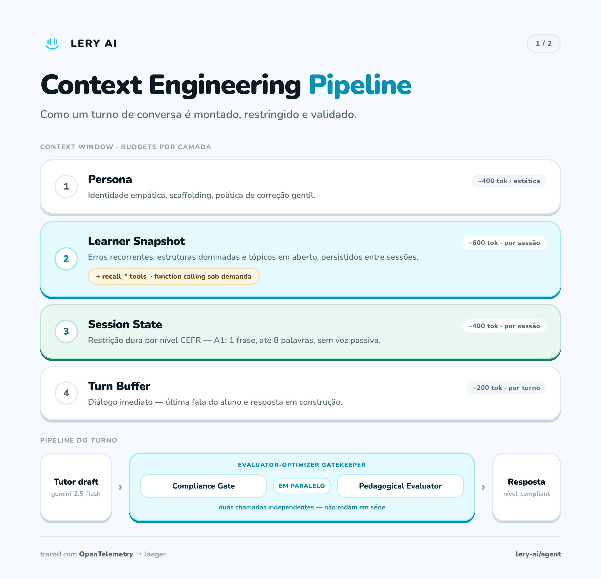

# Lery AI

**A screen-less, voice-first English tutor.** Lery is a smart speaker built on a Raspberry Pi that holds spoken conversations with language learners, adapts to their CEFR level, and evaluates every turn. The companion mobile app shows progress *after* the session, so practice happens without a screen and without the fear of being judged.

This is my Computer Engineering thesis (TCC) at UNISAL. Most of the work is not in the prompt, but in the engineering around it: context assembly, evaluation, latency, and observability.



---

## Why

Many learners study English for years and still freeze when they have to speak. Krashen's *Affective Filter* hypothesis explains part of it: fear of judgment blocks acquisition. An AI tutor should be the ideal low-judgment partner, but a naive setup fails fast: paste a 3,000-token prompt, put an A1 student in front of it, and the model answers at B2/C1. The student freezes again.

Lery treats the LLM as one component in a system that controls **what the model sees, when, and how its output is checked**.

---

## Architecture

Monorepo with four modules:

| Module | What it does | Stack |
|---|---|---|
| [`core/`](core) | Runs on the Raspberry Pi. Voice loop as a state machine (`IDLE → LISTENING → THINKING → SPEAKING`), local wake word, LED ring feedback | Python, openWakeWord, Whisper, Gemini, ElevenLabs/gTTS |
| [`agent/`](agent) | The "brain" as an HTTP service: Tutor, Compliance gate, Evaluator, Summarizer. Channel-agnostic (Pi today, desktop/WhatsApp later) | TypeScript, Fastify 5, Zod, Gemini 2.5 Flash, OpenTelemetry |
| [`api/`](api) | Domain API: users, devices, languages → levels → modules → lessons, sessions, interaction logs, progress | TypeScript, Fastify 5, Prisma, PostgreSQL 15, Swagger |
| [`mobile/`](mobile) | Companion app: onboarding, device pairing (QR + Wi-Fi provisioning), learning journey, results | React Native, Expo Router, TanStack Query, Zustand |

```
 Raspberry Pi (core)             agent/                         api/
┌────────────────────┐   HTTP   ┌──────────────────────────┐   ┌──────────────────┐
│ wake word          │ ───────► │ POST /v1/turns           │──►│ sessions, logs,  │
│ record → Whisper   │          │  ├─ Tutor (Gemini)       │   │ progress         │
│ TTS ← reply        │ ◄─────── │  ├─ Compliance ┐ parallel│   │ PostgreSQL       │
│ LED ring states    │          │  ├─ Evaluator  ┘         │   └──────────────────┘
└────────────────────┘          │  └─ Summarizer (async)   │            ▲
                                └──────────────────────────┘            │
                                        │ OTLP                     mobile/ (Expo)
                                        ▼
                                  Jaeger (tracing)
```

---

## Engineering highlights

### 1. Layered context with explicit token budgets
No monolithic system prompt. The Tutor's context is assembled from four layers, each with its own budget and refresh rate:

| Layer | Refresh | Budget |
|---|---|---|
| Persona | at deploy | ~400 tokens |
| Learner snapshot | per session | ~600 tokens |
| Session state (mode, lesson, objectives) | per turn | ~400 tokens |
| Turn buffer | rolling | bounded |

See [`agent/src/brain/prompts/`](agent/src/brain/prompts).

### 2. Just-in-time retrieval through tool calling
Instead of injecting the full learner history every turn, the Tutor decides when it needs more context and calls one of four tools ([`pedagogical-tools.ts`](agent/src/brain/tools/pedagogical-tools.ts)):
`recall_recent_errors`, `recall_dominated_structures`, `recall_open_topics`, `mark_objective_complete`.

### 3. Compliance gate for beginners
For A1/A2 learners (the ones most likely to freeze), every Tutor draft goes through a compliance check before it is spoken. Violations are typed (`LENGTH_EXCEEDED`, `GRAMMAR_TOO_ADVANCED`, `TONE_OR_ROLE`) and fed back to the Tutor for one corrective retry ([`compliance.ts`](agent/src/brain/compliance.ts)).

### 4. Structured evaluation on four CEFR pillars
The Evaluator scores each turn on **task achievement, grammar, vocabulary and fluency** using Gemini's native structured output (`responseMimeType` + `responseSchema`). No regex over free text. Progress rules sit on top of the probabilistic output: 70% unlocks the next lesson.

### 5. Measured, then optimized
Every model call is wrapped in an OpenTelemetry span under a root `agent.turn` span, and also logged as JSONL for offline p50/p95 reports (`pnpm telemetry:report`).

The Jaeger waterfall showed that the Compliance gate and the Evaluator ran **in series** even though neither depended on the other. They now run with `Promise.all`, which removed a full LLM call from the critical path whenever both run ([`routes/v1/turns/create.ts`](agent/src/routes/v1/turns/create.ts)).

### 6. Evals, not vibes
- **Fixture-based evals** for the Evaluator (beginner errors, advanced fluent speech, empty answers, task failure…), run with `pnpm test:eval`.
- An **[eval report](eval-report.html)** comparing the Python (`core/`) and TypeScript (`agent/`) implementations: 11/11 and 8/9 fixtures passing (the one failure was a quota timeout), at roughly **$0.0001 per evaluation call**.
- A **synthetic student** ([`scripts/simulate-session.ts`](agent/scripts/simulate-session.ts)) with A1/B1 personas that produce realistic mistakes, used to stress the pipeline before any human tests it.

### 7. Long-term memory without blocking the user
When a session closes, a Summarizer runs asynchronously and turns the transcript into a short insight card that feeds the next session's learner snapshot. The student never waits for it.

---

## Running locally

**Requirements:** Node 22+, pnpm, Docker, Python 3.11+ (for `core/`), a Gemini API key.

```bash
# 1. Postgres + Jaeger
docker compose up -d                 # Jaeger UI: http://localhost:16686

# 2. API (port 3333, Swagger at /docs)
cd api && pnpm install && pnpm db:push && pnpm db:seed && pnpm dev

# 3. Agent (port 3334)
cd agent && pnpm install && cp .env.example .env   # set GOOGLE_API_KEY
pnpm dev

# 4. Try a turn
curl -X POST http://localhost:3334/v1/sessions -H 'Content-Type: application/json' -d '{"mode":"FREE_TALK"}'
curl -X POST http://localhost:3334/v1/turns -H 'Content-Type: application/json' \
  -d '{"agentSessionId":"<id>","userText":"I am from Brazil.","evaluate":true}'
```

Tests:

```bash
cd agent && pnpm test          # unit
cd agent && pnpm test:eval     # model evals (calls Gemini)
cd core && pytest              # Python unit tests
```

More detail: [`agent/README.md`](agent/README.md) and [`CLAUDE.md`](CLAUDE.md).

---

## Status

Active thesis project.

- ✅ Voice loop on the Pi with wake word, LED states and TTS fallback (ElevenLabs → gTTS)
- ✅ API with lessons, sessions, interaction logs and progress rules
- ✅ Agent service with layered context, tools, compliance gate, evaluator, summarizer and tracing
- ✅ Mobile app: auth, device pairing, journey and results
- 🚧 Pi `core/` migrating to call the `agent/` service instead of its embedded brain
- 🚧 Score disputes by the learner (API endpoint in place, re-evaluation flow in progress)
- 🚧 Agent sessions are in memory; persistence is next

---

**Talles Amaral** · [LinkedIn](https://linkedin.com/in/tallesamaral) · [tallesamaral.dev](https://tallesamaral.dev)
