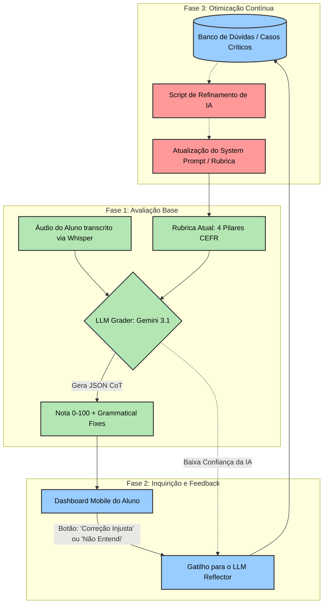

> 🧠 **Voltar para o MOC Principal:** [[Lery AI Brain]]

# 🔄 Fluxograma de Avaliação Lery IA (Inspirado no GradeHITL)

O diagrama fornecido pelo framework **GradeHITL** (arXiv:2504.05239) ilustra um sistema onde o LLM não é estático. Ele avalia, tem dúvidas, consulta humanos e melhora sua própria rubrica. 

Para o escopo do seu TCC, podemos adaptar essa arquitetura de ponta para o ecossistema do **Lery IA**, conectando o hardware, o aplicativo mobile e o banco de dados. Como o aluno é o usuário final (e não necessariamente um professor), o "Human-in-the-Loop" ocorre através do feedback do próprio aluno no App ou de um painel administrativo de curadoria.

Abaixo está o detalhamento de como implementar isso no seu projeto, incluindo o diagrama visual gerado em Mermaid (nativo do Obsidian).

---

## 📊 Diagrama de Arquitetura LeryHITL

Copie e cole o código abaixo no seu Obsidian para visualizar o fluxograma gerado automaticamente:

---

## ⚙️ Como implementar isso na prática (O Passo a Passo)

Para o TCC, você pode documentar que o sistema Lery funciona em três grandes ciclos, baseados no artigo científico:

### 🟩 Fase 1: Avaliação Base (Grading)
É o que você já estruturou. A Raspberry Pi escuta o áudio, o Whisper transforma em texto e envia para o Gemini.
* **O Processo:** O Gemini recebe a transcrição (*Assignment*) e a sua injeção de prompt com os critérios de avaliação (*Current Rubric*).
* **O Resultado:** Ele usa o raciocínio lógico em cadeia (*Chain-of-Thought*) para gerar a nota e os `grammaticalFixes` em JSON.

### 🟦 Fase 2: Inquirição e Validação do Aluno (Inquiring)
Como você quer automatizar o processo e não fazer curadoria manual, o "humano no loop" aqui é única e exclusivamente o próprio **aluno usuário** sinalizando o erro. Sistemas baseados em LLM cometem deslizes (ex: o Whisper entende uma palavra errada por causa do sotaque brasileiro, e o Gemini pune a gramática injustamente).
* **O Processo:** No Aplicativo Mobile, ao lado da correção gerada pela IA, existe um botão de feedback (ex: *"Reportar correção imprecisa"*). 
* **O Resultado:** Quando o aluno clica, isso não vai para você (administrador) ler. Vai direto para o **LLM Reflector** (uma segunda chamada de IA assíncrona), que atua como um juiz analisando a queixa do aluno frente ao contexto da conversa.

### 🟥 Fase 3: Otimização Autônoma da Rubrica (Optimizing)
Aqui o sistema se retroalimenta sem intervenção manual de professores ou de você. (Isso mapeia exatamente para a caixa vermelha "Reflector -> Refiner -> New Rubric" do diagrama original).
* **O Processo:** As interações sinalizadas ativam o agente "Refiner" (um script focado apenas em melhorar regras lógicas).
* **O Resultado:** O Refiner avalia se a queixa do aluno procede. Se sim, ele mesmo **ajusta as diretrizes dinâmicas da Rubrica**. Exemplo: Ele adiciona automaticamente uma instrução no contexto do usuário: *"Não penalize a omissão do som de 'ed' em verbos no passado para este aluno, pois é um traço de sotaque regional"*. O sistema aprende e melhora sozinho de forma escalável.

---

## 📝 O que escrever no TCC sobre esta adaptação?

Você pode incluir este parágrafo na seção de Metodologia para justificar a arquitetura acima:

> *"Inspirado no framework GradeHITL (CHU et al., 2025), o ecossistema LeryIA implementa um pipeline cíclico e autônomo de avaliação e refinamento. Na fase de Grading, o modelo principal avalia a transcrição com base na rubrica CEFR. Contudo, para mitigar alucinações e vieses algorítmicos (como falsos positivos em erros gramaticais devido a sotaques), o aplicativo mobile atua como vetor de Inquiring, onde o próprio aluno sinaliza correções imprecisas. Ao invés de depender de curadoria manual, essas sinalizações ativam agentes secundários (LLM Reflector e Refiner) na fase de Optimizing. Esses agentes analisam a queixa do aluno e atualizam dinamicamente as instruções da rubrica, garantindo que o sistema evolua e se adapte às dificuldades fonéticas do usuário de forma totalmente escalável e automatizada."*